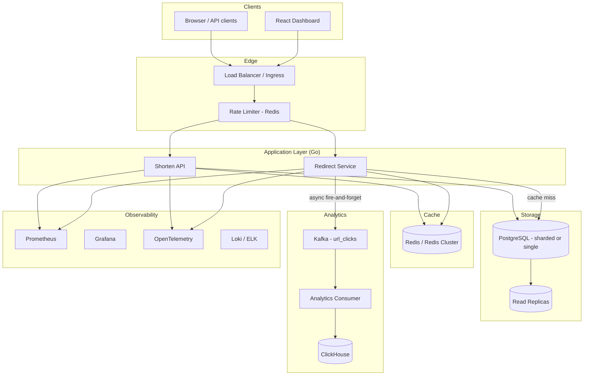
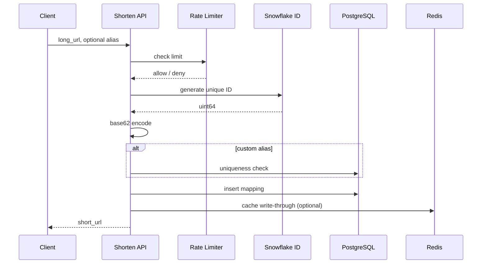
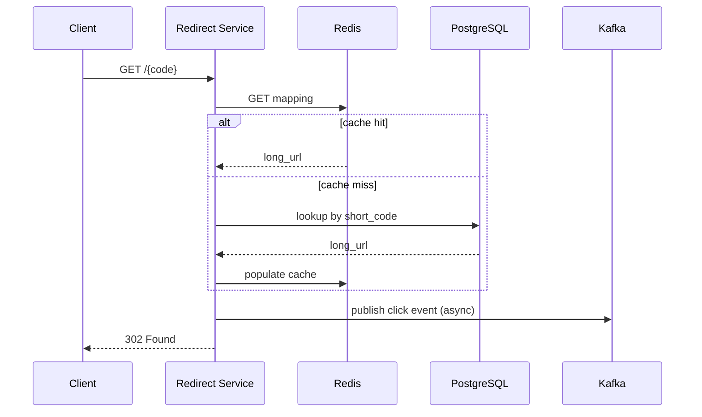

# NexusLink

A production-oriented, scalable URL shortener designed for deep learning in distributed systems, data pipelines, and performance engineering. NexusLink targets SDE-2-level depth: horizontal scalability, sub-100ms redirect latency (p99), observability, and a real analytics pipeline—not a CRUD demo.

This document is the **single source of truth** for architecture, trade-offs, phased delivery, and benchmarks. Refer to it when implementing features, writing ADRs, or preparing interviews.

---

## Table of Contents

1. [Problem Statement](#problem-statement)
2. [Goals & Non-Goals](#goals--non-goals)
3. [Requirements](#requirements)
4. [Capacity Estimates](#capacity-estimates)
5. [Architecture Overview](#architecture-overview)
6. [Core Components](#core-components)
7. [Data Model](#data-model)
8. [API Specification](#api-specification)
9. [Tech Stack](#tech-stack)
10. [Implementation Phases](#implementation-phases)
11. [Benchmarking Plan](#benchmarking-plan)
12. [Observability & Operations](#observability--operations)
13. [Security & Abuse](#security--abuse)
14. [Failure Scenarios](#failure-scenarios)
15. [Project Structure (Planned)](#project-structure-planned)
16. [Local Development](#local-development)
17. [CI/CD & Deployment](#cicd--deployment)
18. [Documentation & Showcase](#documentation--showcase)
19. [Interview Talking Points](#interview-talking-points)
20. [References & Further Reading](#references--further-reading)

---

## Problem Statement

Build a URL shortener that:

- Maps long URLs to compact, URL-safe short codes (base62).
- Resolves redirects with **high availability** and **low latency** under read-heavy traffic.
- Scales to **millions of stored URLs** and **tens of thousands of redirects/clicks per second** (moderate Bitly/TinyURL-scale).
- Captures click analytics **asynchronously** without blocking redirects.
- Demonstrates measurable trade-offs (sharded vs non-sharded, cache strategies, rate limiters).

---

## Goals & Non-Goals

### Goals

| Area | Target |
|------|--------|
| Redirect latency | **< 100ms p99** (cache hit path much lower) |
| Availability | Graceful degradation (e.g., rate limit fail-open, analytics async) |
| Scalability | Stateless services, horizontal scaling, DB sharding |
| Learning | Distributed IDs, sharding, Kafka pipelines, ClickHouse OLAP, benchmarking |
| Portfolio | Benchmarks, diagrams, ADRs, load test results in this README |

### Non-Goals (Initial)

- Exact Bitly-scale multi-region active-active (simulate locally first).
- Perfect exactly-once analytics (at-least-once + idempotent sinks is acceptable).
- Full malware scanning SaaS integration in MVP (stub or allowlist first).

---

## Requirements

### Functional

| ID | Requirement |
|----|-------------|
| F1 | Shorten a long URL → unique short code (base62, 6–8 chars) |
| F2 | Redirect `GET /{short_code}` → 302 to long URL |
| F3 | Optional custom alias (uniqueness enforced) |
| F4 | Link expiry and soft delete |
| F5 | Per-link analytics: clicks, trends, referrers, geo (when available) |
| F6 | User accounts: JWT/OAuth, link management, per-user rate limits |
| F7 | Optional: custom domains, QR codes |

### Non-Functional

| ID | Requirement |
|----|-------------|
| NF1 | Horizontal scale of redirect and shorten paths |
| NF2 | p99 redirect < 100ms under expected load |
| NF3 | Analytics must not block redirect path |
| NF4 | Rate limiting per IP / user / endpoint |
| NF5 | Observability: metrics, traces, structured logs |
| NF6 | Documented failure modes and mitigations |
| NF7 | Empirical benchmarks: sharded vs non-sharded, cache hit ratios |

---

## Capacity Estimates

Assumptions for back-of-envelope sizing (adjust as you measure):

| Parameter | Estimate |
|-----------|----------|
| Stored URLs | 100M |
| Short code length | 7 chars base62 → 62^7 ≈ **3.5 trillion** combinations |
| Avg long URL + metadata | ~500 bytes → **~50 GB** raw URL data (excluding indexes) |
| Redirect QPS (peak) | 10K–50K/s (design target) |
| Shorten QPS | Lower than reads; burst handling via rate limits |
| Click events/day | 100M+ at scale → **Kafka + columnar store**, not sync DB writes |

**Storage growth (URLs only, rough):**

```
100M URLs × 500 B ≈ 50 GB
+ indexes (short_code PK, user_id) → plan 2–3× for Postgres
```

**Analytics (clicks):**

```
100M clicks/day × ~200 B/event ≈ 20 GB/day raw
→ ClickHouse with TTL + partitioning by date
```

---

## Architecture Overview

Start as a **modular monolith** (Go), extract microservices when complexity justifies it (redirector, shorten API, analytics consumer).

### High-Level Diagram



### Request Flows

#### Shorten (`POST /api/shorten`)



#### Redirect (`GET /{short_code}`)



> Use **302** for redirects when analytics matter (302 allows re-validation). Use **301** only for explicitly permanent links.

---

## Core Components

### 1. Short URL Generation (Base62 + Distributed IDs)

**Do not use** a single global auto-increment (SPOF, shard-unfriendly).

**Preferred: Snowflake-style IDs**

| Field | Bits (typical) | Purpose |
|-------|----------------|---------|
| Timestamp | 41 | Sortable, time-roughly-ordered |
| Datacenter + Machine | 10 | Uniqueness per node |
| Sequence | 12 | Per-ms counter on one machine |

- Encode `uint64` ID → **base62** (`[a-zA-Z0-9]`) for URL-safe short codes.
- Target **6–8 characters** → trillions of combinations with low collision probability when IDs are globally unique.
- **Collision handling**: If custom alias or rare collision, check DB before insert; retry with new ID if needed.

**Base62 example (conceptual):**

```
ID: 112345678901234567
Alphabet: 0-9, a-z, A-Z (62 symbols)
Encode: repeated div/mod → map to alphabet indices → reverse string
```

**Custom aliases**: Separate code path; `short_code` is user-provided; enforce uniqueness and reserved-word blocklist (`api`, `admin`, etc.).

---

### 2. Storage Layer & Sharding

**Primary DB: PostgreSQL** (ACID, familiar ops). Consider Cassandra/Mongo only if you explicitly want to learn native document sharding later.

**Tables (conceptual):**

- `url_mappings` — hot path: `short_code` (PK), `long_url`, `user_id`, `created_at`, `expires_at`, `is_active`
- `users`, `domains` — account and custom domain metadata

**Sharding strategies (implement both for benchmarks):**

| Strategy | Key | Pros | Cons |
|----------|-----|------|------|
| Hash on `short_code` | Consistent hash ring | Even spread, O(1) routing | Rebalancing on shard add/remove |
| Range on Snowflake ID | ID ranges per shard | Simple inserts | Hot shards if access skewed |

**Read scaling**: Read replicas for redirect lookups; writes to primary (or shard primary).

**Learning deliverable**: Run **sharded** and **non-sharded** deployments; document throughput and p99 latency vs operational cost.

**Tools to explore**: Application-level routing, `pg_shard` patterns, or Vitess/ProxySQL for MySQL/Postgres proxy sharding.

---

### 3. Caching (Redis)

| Pattern | Use case |
|---------|----------|
| Read-through | Redirect: Redis → on miss, DB → set Redis |
| Write-through / invalidate | On shorten/update, update or delete cache key |
| TTL | Default TTL on mappings; shorter for expiring links |
| LRU / maxmemory | `allkeys-lru` for cluster memory pressure |

**Click counters (optional optimization):**

- `INCR click:{short_code}` in Redis
- Periodic flush to DB or rely on ClickHouse for authoritative analytics

**Hot viral links**: Cache aggressively; consider local in-process LRU in front of Redis on redirect nodes.

---

### 4. Rate Limiting (Redis)

Implement **multiple algorithms** for learning; pick production default after benchmarks.

| Algorithm | Behavior | Memory | Burst handling |
|-----------|----------|--------|----------------|
| Fixed window | Count per window | Low | Boundary spikes |
| Sliding window counter | Weighted sub-windows | Medium | Better |
| Sliding window log | Timestamp log per request | High | Precise |
| Token bucket | Steady rate + burst tokens | Medium | Good for APIs |

**Scope:**

- Per-IP: anonymous shorten/redirect abuse
- Per-user: authenticated API limits
- Per-endpoint: e.g. 100 shorten/min, higher redirect limits

**Distributed atomicity**: Redis **Lua scripts** for check-and-increment.

**Availability trade-off**: **Fail-open** if Redis unavailable (allow traffic, log alert)—document this in ADRs.

---

### 5. Redirect Service

- **Stateless** HTTP handlers behind load balancer.
- Path: `GET /{short_code}` only on redirect host (or shared router).
- Lookup order: **Redis → PostgreSQL (replica)**.
- **Never** synchronously write analytics to ClickHouse/Postgres on redirect path.
- Publish click event to Kafka with minimal payload enrichment on hot path; enrich in consumer if needed.

---

### 6. Analytics Pipeline (Differentiator)

**Event topic**: `url_clicks`

**Producer (on redirect, async):**

```json
{
  "short_code": "aB3xY9z",
  "timestamp": "2026-05-19T12:00:00Z",
  "ip": "203.0.113.1",
  "user_agent": "...",
  "referrer": "https://example.com",
  "request_id": "uuid"
}
```

**Consumer**: Kafka consumer group → batch insert **ClickHouse**.

**Why ClickHouse over Postgres for analytics:**

| Concern | ClickHouse | Postgres |
|---------|------------|----------|
| Aggregations over billions of rows | Columnar, fast | Slower at scale |
| Compression | Excellent | Higher storage cost |
| Real-time dashboards | Materialized views, fast GROUP BY | Materialized views help but OLTP not ideal |

**Simpler alternative (Phase 2b)**: Postgres + materialized views for learning before ClickHouse.

**Queries to support:**

- Total clicks per `short_code`
- Clicks over time (hourly/daily)
- Top referrers, geo distribution (MaxMind GeoLite2 in consumer)
- Spike detection (bonus): threshold alerts on click rate

**Semantics**: At-least-once delivery from Kafka; **idempotent** consumer (e.g., dedupe by `request_id` or accept approximate counts for learning).

---

### 7. Additional Production Features

| Feature | Notes |
|---------|-------|
| Auth | JWT access tokens; OAuth2 optional; rate limits per `user_id` |
| Expiry / deletion | `expires_at` TTL; soft delete `is_active=false`; cache purge |
| URL validation | Scheme allowlist (http/https); block private IPs (SSRF); optional external safe-browsing API |
| Custom domains | DNS CNAME → your edge; domain table + TLS (cert-manager) |
| QR codes | Generate PNG/SVG on shorten or on-demand endpoint |
| Multi-region | Start with Docker Compose “regions”; later multi-cluster K8s |
| gRPC | Internal services (redirect ↔ analytics admin) with protobuf |

---

## Data Model

### `url_mappings`

| Column | Type | Notes |
|--------|------|-------|
| `short_code` | VARCHAR(16) PK | base62 or custom alias |
| `long_url` | TEXT | normalized URL |
| `snowflake_id` | BIGINT UNIQUE | optional, for range sharding |
| `user_id` | UUID NULL | FK to users |
| `created_at` | TIMESTAMPTZ | |
| `expires_at` | TIMESTAMPTZ NULL | |
| `is_active` | BOOLEAN | soft delete |
| `http_status` | SMALLINT | 302 default |

**Indexes**: PK on `short_code`; index on `user_id`, `created_at` for dashboard.

### ClickHouse `clicks` (example)

| Column | Type |
|--------|------|
| `short_code` | String |
| `timestamp` | DateTime64 |
| `ip` | String |
| `country` | LowCardinality(String) |
| `referrer` | String |
| `user_agent` | String |

**Partition by**: `toYYYYMM(timestamp)`  
**Order by**: `(short_code, timestamp)`

---

## API Specification

Base URL: `https://nexuslink.example` (or local `http://localhost:8080`)

### REST (Public)

| Method | Path | Description |
|--------|------|-------------|
| `POST` | `/api/v1/shorten` | Create short URL |
| `GET` | `/{short_code}` | Redirect (302) + track click |
| `GET` | `/api/v1/analytics/{short_code}` | Aggregated stats (auth required for private links) |
| `DELETE` | `/api/v1/links/{short_code}` | Soft delete |
| `GET` | `/health` | Liveness |
| `GET` | `/ready` | Readiness (DB, Redis, Kafka) |

### `POST /api/v1/shorten`

**Request:**

```json
{
  "long_url": "https://example.com/very/long/path",
  "custom_alias": "optional",
  "expires_in_seconds": 86400
}
```

**Response (201):**

```json
{
  "short_code": "aB3xY9z",
  "short_url": "https://nx.link/aB3xY9z",
  "long_url": "https://example.com/very/long/path",
  "expires_at": "2026-05-20T12:00:00Z"
}
```

**Errors:** `400` invalid URL, `409` alias taken, `429` rate limited, `401` unauthorized (if auth required).

### `GET /api/v1/analytics/{short_code}`

**Response (200):**

```json
{
  "short_code": "aB3xY9z",
  "total_clicks": 15420,
  "clicks_by_day": [{"date": "2026-05-19", "count": 1200}],
  "top_referrers": [{"referrer": "https://twitter.com", "count": 800}],
  "top_countries": [{"country": "US", "count": 5000}]
}
```

### Internal (gRPC, later)

- `ShortenService.Create`
- `AnalyticsService.GetStats`

---

## Tech Stack

| Layer | Choice | Rationale |
|-------|--------|-----------|
| Backend | **Go** | Performance, concurrency, strong fit for infra-style services |
| Primary DB | **PostgreSQL** | ACID, mature, read replicas |
| Cache / rate limit | **Redis** (Cluster at scale) | Sub-ms lookups, Lua atomicity |
| Messaging | **Kafka** (or **Redpanda** locally) | Durable click stream |
| Analytics store | **ClickHouse** | OLAP, aggregations |
| Frontend | **React** + Recharts/Chart.js | Demo dashboard |
| Observability | Prometheus, Grafana, OpenTelemetry, Loki |
| Infra | Docker Compose → Kubernetes; Terraform; GitHub Actions |
| Load testing | **k6** or **Locust** | Document results here |

---

## Implementation Phases

Total estimate: **2–3 months part-time**. Do not skip measurement between phases.

### Phase 1 — MVP (1–2 weeks)

- [ ] Go HTTP server, config, structured logging
- [ ] Postgres single node: `url_mappings`
- [ ] Counter or simple Snowflake → base62 shorten
- [ ] `GET /{code}` → 302 redirect
- [ ] Basic URL validation
- [ ] Docker Compose: app + Postgres
- [ ] Unit tests for base62 and handlers

**Exit criteria:** Shorten + redirect works E2E locally.

---

### Phase 2 — Scale Core (2–3 weeks)

- [ ] Production Snowflake ID (multi-instance safe)
- [ ] Redis read-through cache
- [ ] Rate limiting (implement ≥2 algorithms; ship one)
- [ ] Read replica routing for redirects
- [ ] Manual or hash-based **sharding** + parallel **non-sharded** mode
- [ ] JWT auth + user-owned links
- [ ] Prometheus metrics middleware

**Exit criteria:** Cache hit ratio visible in metrics; rate limit returns 429.

---

### Phase 3 — Analytics Pipeline (2 weeks)

- [ ] Kafka producer on redirect (non-blocking)
- [ ] Consumer → ClickHouse batch inserts
- [ ] Analytics API backed by ClickHouse queries
- [ ] Optional: GeoIP in consumer
- [ ] React dashboard: charts for clicks over time

**Exit criteria:** Click on short link appears in analytics within seconds (define SLA).

---

### Phase 4 — Production Hardening (2–3 weeks)

- [ ] OpenTelemetry traces across redirect → Kafka
- [ ] Grafana dashboards (QPS, p99, errors, cache hit %, shard balance)
- [ ] Load tests: baseline, viral read, write burst
- [ ] **Sharded vs non-sharded benchmark report** (section below)
- [ ] CI: test, lint, build images
- [ ] K8s manifests or Compose scale-out (3+ app instances)
- [ ] ADRs for major decisions

**Exit criteria:** README benchmark table filled with real numbers.

---

### Phase 5 — Polish & Extras (1–2 weeks)

- [ ] Custom domains
- [ ] QR code endpoint
- [ ] Link expiry cron + cache invalidation
- [ ] Public demo deployment (free tier cloud)
- [ ] Blog post: "Building NexusLink: MVP to Production"

---

## Benchmarking Plan

### Scenarios

| Scenario | Description | Primary metrics |
|----------|-------------|-----------------|
| A — Baseline | Single app instance, no shard | shorten + redirect p50/p99, RPS |
| B — Read heavy | 95% redirect, 5% shorten; one viral `short_code` | cache hit %, p99 |
| C — Write burst | Many unique shortens | DB CPU, insert TPS |
| D — Sharded vs not | Same hardware, scale DB/app | throughput, p99, ops complexity |

### Tools

- **k6** or **Locust** for HTTP load
- **pgbench** or custom SQL for DB-only baselines
- **Prometheus** scrape during tests; export Grafana screenshots to `docs/benchmarks/`

### Results Template (fill after Phase 4)

| Config | Redirect RPS | Shorten RPS | p99 redirect (ms) | Cache hit % | Notes |
|--------|--------------|-------------|-------------------|-------------|-------|
| Single PG, no Redis | | | | N/A | |
| PG + Redis | | | | | |
| Sharded PG (N shards) | | | | | |
| Non-sharded PG (same total CPU) | | | | | |

**Expected narrative (example—replace with your data):**

> Sharding improved write throughput by X% at Y insert RPS but added Z% redirect latency due to routing. At read-heavy workloads with 90%+ cache hit rate, non-sharded Postgres with replicas was sufficient until ___ RPS.

---

## Observability & Operations

### Metrics (Prometheus)

- `http_requests_total{method, path, status}`
- `http_request_duration_seconds` histogram
- `cache_hits_total` / `cache_misses_total`
- `kafka_produce_errors_total`
- `rate_limit_exceeded_total`
- `db_query_duration_seconds`

### Tracing (OpenTelemetry)

- Span: redirect handler → Redis → DB → Kafka produce (async span or link)

### Logging

- Structured JSON: `request_id`, `short_code`, `latency_ms`, `shard_id`

### Dashboards

- Golden signals per service
- Shard CPU/connection balance
- Kafka consumer lag

---

## Security & Abuse

| Threat | Mitigation |
|--------|------------|
| SSRF via long URL | Block localhost, RFC1918, metadata IPs; allowlist schemes |
| Phishing | Optional Google Safe Browsing API; report link endpoint |
| Enumeration | Non-guessable Snowflake codes; rate limit redirects per IP |
| Auth bypass | Validate JWT on management/analytics routes |
| Redis down | Fail-open rate limit (documented); cache miss → DB only |

---

## Failure Scenarios

| Failure | System behavior | Mitigation |
|---------|-----------------|------------|
| Redis unavailable | Redirects hit DB; higher latency | Replica + circuit breaker; alert |
| Kafka unavailable | Redirect still 302; click loss acceptable short-term | Local buffer queue (bonus); monitor lag |
| Postgres primary down | Failover to replica / HA setup | Patroni or managed RDS |
| Hot shard | One shard saturated | Reshard; cache viral keys; CDN edge (future) |
| Snowflake clock skew | Duplicate/rare ID issues | NTP; small sequence backoff |

---

## Project Structure (Planned)

```
NexusLink/
├── README.md                 # This file
├── docs/
│   ├── adr/                  # Architecture Decision Records
│   ├── architecture/         # Diagrams (Excalidraw exports)
│   └── benchmarks/           # Load test results, graphs
├── cmd/
│   ├── api/                  # Shorten + management API
│   ├── redirect/             # Redirect-only service (optional split)
│   └── consumer/             # Kafka → ClickHouse worker
├── internal/
│   ├── idgen/                # Snowflake
│   ├── encoding/             # base62
│   ├── shorten/
│   ├── redirect/
│   ├── cache/
│   ├── ratelimit/
│   ├── analytics/
│   ├── storage/              # Postgres repos, sharding router
│   └── auth/
├── api/
│   └── openapi.yaml          # REST contract
├── proto/                    # gRPC definitions (later)
├── web/                      # React dashboard
├── deploy/
│   ├── docker-compose.yml
│   ├── docker-compose.analytics.yml
│   ├── k8s/
│   └── terraform/
├── scripts/
│   ├── migrate.sh
│   └── loadtest/
├── migrations/               # SQL migrations
└── .github/workflows/
```

---

## Local Development

> **Status:** Phase 1 foundation implemented.

### Prerequisites

- Go 1.22+
- Docker & Docker Compose
- `make` (optional)

### Quick start

```bash
git clone https://github.com/JathinShyam/NexusLink.git
cd NexusLink
cp .env.example .env
make docker-up          # Postgres + migrate + API
make health             # curl /health → {"status":"ok"}
```

Run the API locally (Postgres must be up):

```bash
make docker-up          # starts Postgres only if API already running locally, use: docker compose -f deploy/docker-compose.yml up -d postgres migrate
make migrate-up
make run
```

Or full stack in Docker:

```bash
make docker-up
curl http://localhost:8080/health
```

### Shorten and redirect (Phase 2)

```bash
make demo

# Or manually:
curl -X POST http://localhost:8080/api/v1/shorten \
  -H 'Content-Type: application/json' \
  -d '{"long_url":"https://example.com/hello"}'

# Visit the short_url from the response, or:
curl -I http://localhost:8080/<short_code>
```

### Environment variables (planned)

| Variable | Description |
|----------|-------------|
| `DATABASE_URL` | Postgres connection string |
| `REDIS_URL` | Redis address |
| `KAFKA_BROKERS` | Comma-separated brokers |
| `CLICKHOUSE_URL` | HTTP/native ClickHouse URL |
| `JWT_SECRET` | Signing key |
| `SNOWFLAKE_MACHINE_ID` | 0–1023 per instance |

---

## CI/CD & Deployment

### GitHub Actions (planned)

1. Lint (`golangci-lint`)
2. Unit + integration tests (testcontainers for Postgres/Redis/Kafka)
3. Build and push Docker images
4. Optional: deploy to staging on `main`

### Target cloud (flexible)

- **AWS**: ECS/EKS, RDS, ElastiCache, MSK, ClickHouse Cloud or self-hosted
- **GCP**: GKE, Cloud SQL, Memorystore, Managed Kafka alternative
- **Local prod-like**: Docker Compose with 3 app replicas + Prometheus

---

## Documentation & Showcase

### ADR topics to write (`docs/adr/`)

1. Snowflake vs UUID vs DB sequence
2. Hash sharding vs range sharding
3. ClickHouse vs Postgres for analytics
4. Rate limit algorithm choice
5. Fail-open vs fail-closed on Redis outage
6. 302 vs 301 default for redirects

### README maintenance

- Update [Benchmarking Plan](#benchmarking-plan) results after each major test
- Add architecture diagram PNGs to `docs/architecture/`
- Link live demo URL when deployed

### Blog outline

1. MVP: base62 and redirects
2. Caching and p99 latency
3. Sharding experiments with numbers
4. Kafka → ClickHouse pipeline
5. What I'd do differently at 10× scale

---

## Interview Talking Points

Prepare 2–3 minute stories for each:

1. **ID generation:** Why Snowflake; how base62 length relates to capacity; collision handling.
2. **Sharding:** Consistent hashing on `short_code`; when sharding hurt more than helped (cite your benchmark table).
3. **Hot viral link:** Cache layers; why not to write clicks synchronously to OLTP DB.
4. **Analytics:** At-least-once Kafka; ClickHouse schema and partitioning; materialized views for dashboard queries.
5. **Rate limiting:** Compared algorithms; Lua atomicity; fail-open trade-off for availability.
6. **Observability:** How you proved p99 < 100ms and what broke it under load.

---

## References & Further Reading

- [Twitter Snowflake](https://github.com/twitter-archive/snowflake) — distributed ID inspiration
- [Consistent Hashing](https://en.wikipedia.org/wiki/Consistent_hashing) — shard routing
- [Redis rate limiting patterns](https://redis.io/docs/latest/develop/use/patterns/rate-limiting/)
- [ClickHouse docs](https://clickhouse.com/docs) — MergeTree, partitioning
- [Google SRE — Golden Signals](https://sre.google/sre-book/monitoring-distributed-systems/)
- System design: "Design a URL shortener" (standard SDE-2 prompt—map answers to this doc)

---

## License

TBD (suggest MIT for portfolio projects).

---

## Changelog

| Date | Change |
|------|--------|
| 2026-05-19 | Initial project specification and README (pre-implementation) |

---

**Next step when coding begins:** Phase 1 MVP — initialize Go module, `docker-compose.yml` with Postgres, implement `internal/encoding/base62` and `internal/idgen/snowflake`, then `POST /api/v1/shorten` and `GET /{short_code}`.
